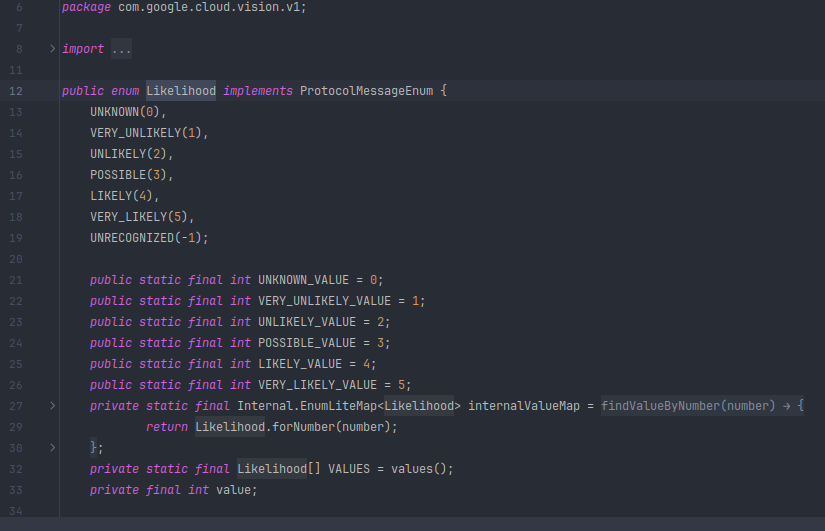
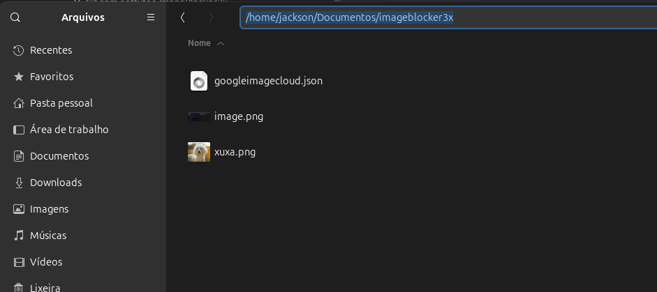

# imageBlocker3x

A Detecção do imageBlocker3x identifica conteúdo adulto ou violento em uma imagem. Esse recurso usa cinco categorias (adult, spoof, medical, violence e racy) e retorna a probabilidade de que cada uma esteja presente em determinada imagem. Se a probabilidade for alta o bloqueio é feito.

o Ajuste da probabilidade de bloqueio é feito no código-fonte.

### Local do storage e chave de acesso da API do Google Cloud Vision

fonte: https://cloud.google.com/vision?hl=pt_br